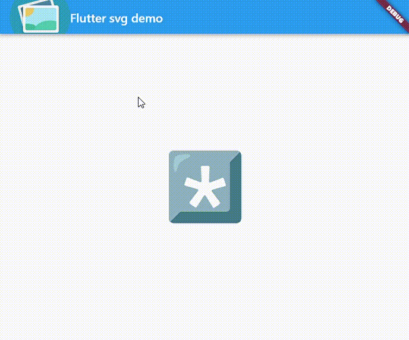
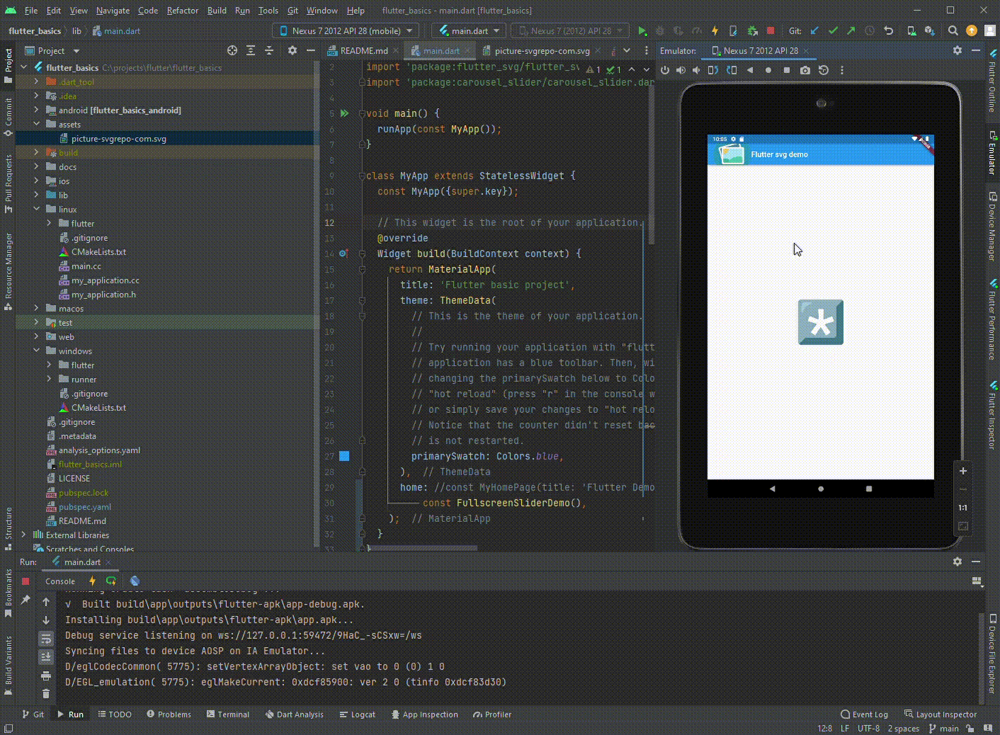
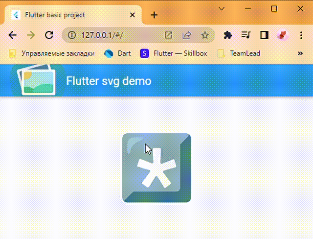

# flutter_basics
This app demonstrates adding svg package.
Pictures are imported as local asset and over network
App is build for three platforms
* Windows Native Application: 
* Android app 
* Web App 
